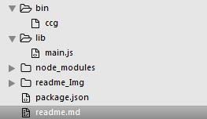
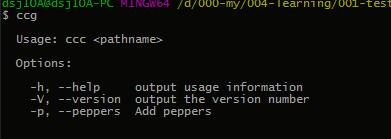

## npm 全局命令行工具生成

### 1.项目说明：
* 此demo用于简单进行npm全局命令行工具的制作，用到commander
* commander官方解释：Node.js命令行界面的完整解决方案，受Ruby的指挥官的启发。
* [官方学习地址](https://www.npmjs.com/package/commander)
* 项目的功能基本满足简单全局命令行工具的开发使用，想制作复杂的请忽略此文。

### 2.start

#### 2.1 基本目录：



#### 2.2 目录说明：

* bin目录下有ccg文件，此文件没有后缀名，是命令行工具的入口文件。（ccg是我自己随便来的名字，制作工具时按照自己的需求进行设置名字。）
* lib目录下有main.js，此文件为主入口文件所依赖的基础模块。
* package.json为生成工具前的配置文件。
* 依据自己的需求进行docs、test和readme.md文件的补充。

#### 2.3 bin/ccg文件：

```
#!/usr/bin/env node

/**
 * Module dependencies.
 */
// 入口文件可以没有后缀名，里面用commaner，lib的索引
var program = require('commander');
// 读取package.json里面的版本号
var version = require('../package.json').version;
// 引入自己写的模块
var read = require('../lib/main');
program
  // 命令行工具注册版本号
  .version(version)
  // 命令行工具注册命令
  .option('-p, --peppers', 'Add peppers')
  // 使用方法的提示
  .usage('<pathname>')
  // 解析路径上有用的参数，非命令选项
  .parse(process.argv);

// 上面所有注册所有的命令和用法进行提示说明，在没有按照命令和使用说明--使用时
if (program.args.length === 0) {
    program.help();
} 
// 执行-p, --peppers命令的执行函数
else if(program.peppers) {
    console.log('  - pineapple');
}
// 按照使用方法进行 文件路径为参数的执行函数
else {
  read(program.args[0]);
}
```

* program.help()的提示：



#### 2.3 lib/main.js文件：

```
#!
var fs = require('fs');
module.exports = function (path) {
    /* body... */
    console.log(fs.readFileSync(path, 'utf-8')) 
}
```

#### 2.3 package.json文件：

```
#!
{
  "name": "013-test",
  "version": "1.0.0",
  "description": "",
  "main": "./bin/ccg",
  "bin": {
    "cc-g": "./bin/ccg"
  },
  "dependencies": {
    "commander": "^2.9.0"
  },
  "devDependencies": {},
  "scripts": {
    "test": "echo \"Error: no test specified\" && exit 1"
  },
  "author": "cc",
  "license": "MIT"
}

```

#### 2.4 npm install . -g：

* 发布之前一定要本地全局测试。

### 3.summary

* 文件操作的基础模块那里使用相对路径：`fs.readFileSync(path, 'utf-8')`，就是相对于全局命令行工具所在的目录的相对路径。

### 4.MIT copyright by CC

